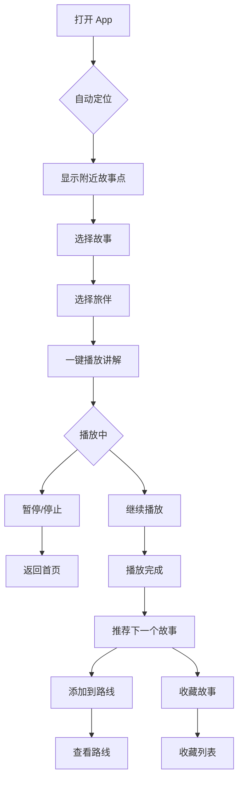

## 1. Product Overview
沉浸式讲解 App——用户选择不同人格旅伴，到达景点后一键播放历史与文化讲解。这是一个"旅行中的故事开关"，让用户在旅途中一键召唤会讲故事、会共情、会带时代感的旅伴。

- **核心价值**: 将"打开 app"设计成轻操作，降低用户使用门槛，让用户在"我现在到这了，我想知道这里的故事"时才打开
- **目标用户**: 自由行游客、历史文化爱好者、喜欢边走边听的旅行者
- **市场价值**: 区别于现有 GPS 音频导览产品，差异点在于"谁在讲、怎么讲、为什么打动人"

## 2. Core Features

### 2.1 User Roles
| Role | Registration Method | Core Permissions |
|------|---------------------|------------------|
| Normal User | 无需注册 | 浏览故事、选择旅伴、播放讲解、收藏内容 |

### 2.2 Feature Module
1. **首页**: 当前位置附近故事点推荐、一键播放入口
2. **旅伴选择**: 不同人格旅伴列表（苏东坡、林徽因、温柔女士、毒舌老炮等）
3. **播放页面**: 故事详情、播放控制、进度显示
4. **路线规划**: 多个故事点串联成完整旅行路线
5. **收藏列表**: 用户收藏的故事和回放

### 2.3 Page Details
| Page Name | Module Name | Feature description |
|-----------|-------------|---------------------|
| 首页 | 定位推荐 | 自动识别位置，显示附近故事点卡片 |
| 首页 | 一键播放 | 当前位置故事一键播放入口 |
| 首页 | 热门故事 | 热门/推荐故事列表 |
| 旅伴选择 | 旅伴列表 | 展示不同人格旅伴，支持选择 |
| 旅伴选择 | 旅伴详情 | 旅伴介绍、风格说明 |
| 播放页面 | 故事详情 | 故事标题、地点、时长、简介 |
| 播放页面 | 播放器 | 播放/暂停、进度条、音量控制 |
| 播放页面 | 相关推荐 | 相关故事和地点推荐 |
| 路线规划 | 路线列表 | 预设路线和自定义路线 |
| 路线规划 | 路线详情 | 路线包含的故事点、预计时长 |
| 收藏列表 | 收藏内容 | 用户收藏的故事、旅伴、路线 |

## 3. Core Process

## 4. User Interface Design

### 4.1 Design Style
- **主色调**: 深邃的藏青色 (#0A1628) 作为背景，金色 (#D4AF37) 作为强调色，营造沉浸式历史氛围
- **辅助色**: 琥珀色 (#F5A623) 用于交互元素，浅灰蓝 (#E8F4F8) 用于文字
- **按钮风格**: 圆角胶囊形，金色渐变边框，悬停时发光效果
- **字体**: 标题使用"Noto Serif SC"衬线字体，正文使用"Noto Sans SC"无衬线字体
- **布局风格**: 卡片式布局，沉浸式全屏播放界面，深色主题
- **图标风格**: 线性图标，金色描边，简洁优雅

### 4.2 Page Design Overview

| Page Name | Module Name | UI Elements |
|-----------|-------------|-------------|
| 首页 | 顶部导航 | Logo、定位图标、搜索按钮 |
| 首页 | 定位推荐 | 大尺寸故事卡片，突出"一键播放"按钮 |
| 首页 | 故事列表 | 横向滚动卡片列表，显示故事封面、标题、距离 |
| 旅伴选择 | 旅伴卡片 | 圆形头像、姓名、风格标签、简短介绍 |
| 播放页面 | 背景图 | 全屏模糊背景，故事相关图片 |
| 播放页面 | 播放控制 | 大尺寸播放按钮、进度条、时间显示 |
| 播放页面 | 故事信息 | 标题、地点、旅伴头像、简介 |
| 路线规划 | 路线卡片 | 路线名称、故事点数量、预计时长、距离 |
| 收藏列表 | 收藏项 | 故事封面、标题、收藏时间 |

### 4.3 Responsiveness
- **移动端优先**: 针对手机屏幕优化，支持竖屏使用
- **触控优化**: 大尺寸按钮，易于单手操作
- **响应式布局**: 自适应不同屏幕尺寸

### 4.4 Motion Effects
- **页面切换**: 平滑过渡动画，从卡片展开到全屏播放
- **播放状态**: 波形动画表示正在播放
- **定位动画**: 脉冲动画表示定位中
- **收藏动画**: 心形图标填充动画
