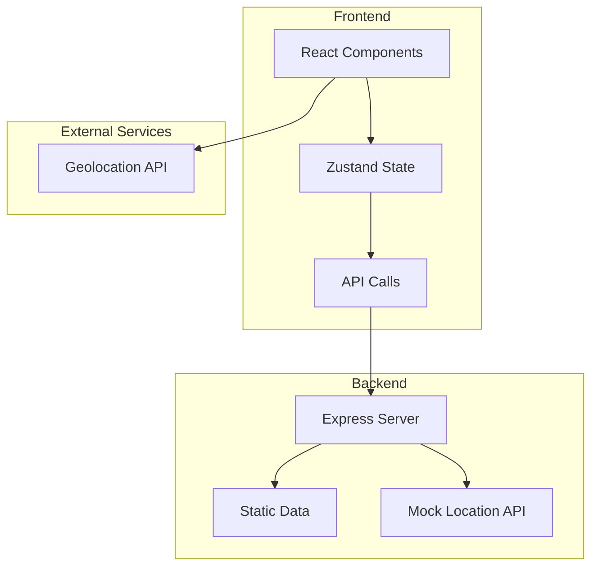
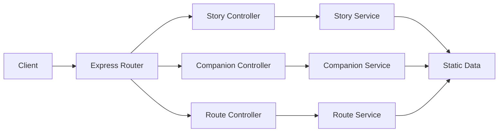
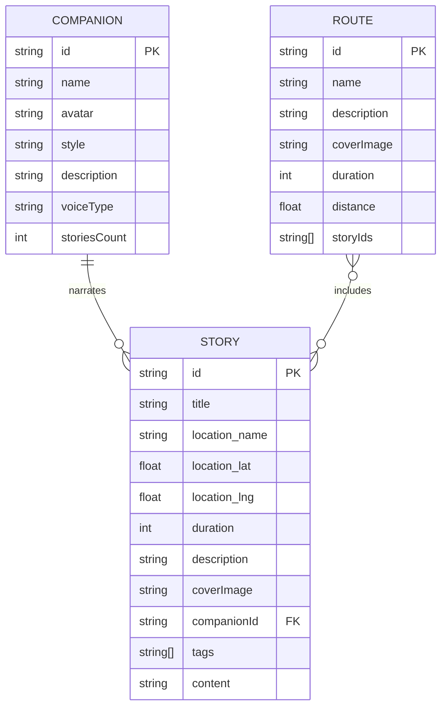

## 1. Architecture Design



## 2. Technology Description
- **Frontend**: React@18 + TypeScript + TailwindCSS@3 + Vite
- **State Management**: Zustand
- **Routing**: React Router DOM
- **Icons**: Lucide React
- **Backend**: Express@4 (提供静态数据和模拟 API)
- **Database**: 无（使用静态 JSON 数据）

## 3. Route Definitions
| Route | Purpose | Component |
|-------|---------|-----------|
| / | 首页 | HomePage |
| /companions | 旅伴选择 | CompanionsPage |
| /story/:id | 故事详情与播放 | StoryPlayerPage |
| /routes | 路线规划 | RoutesPage |
| /favorites | 收藏列表 | FavoritesPage |

## 4. API Definitions

### 4.1 Get Nearby Stories
**GET** `/api/stories/nearby?lat={lat}&lng={lng}`

**Response:**
```typescript
interface Story {
  id: string;
  title: string;
  location: {
    name: string;
    lat: number;
    lng: number;
  };
  distance: number; // 距离（米）
  duration: number; // 时长（秒）
  description: string;
  coverImage: string;
  companionId: string;
  tags: string[];
}
```

### 4.2 Get All Stories
**GET** `/api/stories`

**Response:** `Story[]`

### 4.3 Get Story by ID
**GET** `/api/stories/:id`

**Response:** `Story & { content: string }`

### 4.4 Get All Companions
**GET** `/api/companions`

**Response:**
```typescript
interface Companion {
  id: string;
  name: string;
  avatar: string;
  style: string; // 风格描述
  description: string;
  voiceType: string; // 音色类型
  storiesCount: number;
}
```

### 4.5 Get Companion by ID
**GET** `/api/companions/:id`

**Response:** `Companion & { stories: Story[] }`

### 4.6 Get Routes
**GET** `/api/routes`

**Response:**
```typescript
interface Route {
  id: string;
  name: string;
  description: string;
  coverImage: string;
  duration: number; // 预计时长（分钟）
  distance: number; // 距离（公里）
  storyIds: string[];
}
```

### 4.7 Get Route by ID
**GET** `/api/routes/:id`

**Response:** `Route & { stories: Story[] }`

## 5. Server Architecture Diagram



## 6. Data Model

### 6.1 Data Model Definition


### 6.2 Sample Data

**Companions:**
1. 苏东坡 - 豪放派诗人，风趣幽默，善于用诗词解读历史
2. 林徽因 - 知性优雅，充满人文气息，擅长建筑与文学
3. 温柔女士 - 温婉动人，娓娓道来，适合轻松惬意的聆听
4. 毒舌老炮 - 犀利幽默，一针见血，带来独特视角

**Stories:**
- 西湖断桥 - 白蛇传的传说
- 故宫太和殿 - 明清两代的权力中心
- 苏州园林拙政园 - 江南园林艺术的巅峰
- 西安兵马俑 - 千古一帝的地下军团

**Routes:**
- 杭州一日游 - 西湖十景串联
- 北京故宫深度游 - 三大殿到御花园
- 苏州园林之旅 - 拙政园、留园、狮子林
