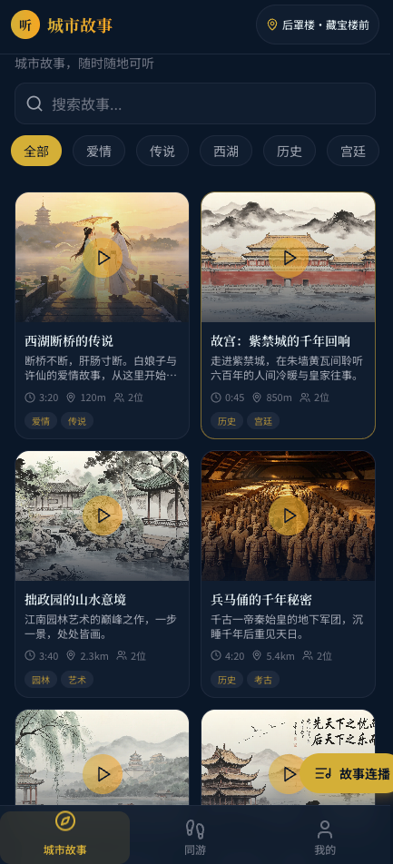

# 同游 - 沉浸式讲解 App 原型

一款以**同游（边走边听）**为核心的沉浸式 AI 旅伴应用；MVP 聚焦恭王府动线与苏东坡 / 毒舌老炮双旅伴。

**在线体验：** [https://buddy-8ov.pages.dev/walk](https://buddy-8ov.pages.dev/walk)




---

## 🧭 产品导航

| Tab | 路径 | 说明 |
|-----|------|------|
| **同游** | `/walk`（默认首页） | 恭王府模拟游览、围栏触发、聊天式讲解 |
| **城市故事** | `/discover` | 浏览 / 搜索城市故事，可切换旅伴听不同版本 |
| **我的** | `/profile` | 默认旅伴、收藏、设置 |

---

## ✨ 核心功能

### 同游 · 边走边听 (`/walk`)

- 恭王府 12 站点模拟游览，无需现场 GPS
- 进入围栏自动触发讲解，随机播放未播段子的第一幕
- 卡片内支持「继续说 / 上一幕」切换 1～3 幕
- 旅伴状态机：空闲 → 准备中 → 讲解中 → 空闲
- 使用 ElevenLabs TTS 语音合成

### 城市故事 (`/discover`)

- 双列卡片展示城市故事
- 按标题、描述搜索，按标签筛选
- 支持切换旅伴听不同讲解版本

---

## 🏗️ 技术栈

- **前端**: React 18 + TypeScript + Vite 6 + TailwindCSS 3
- **状态管理**: Zustand
- **路由**: React Router DOM 7
- **部署**: Cloudflare Pages + Pages Functions
- **语音**: ElevenLabs TTS

---

## 🚀 开发运行

```bash
# 安装依赖
npm install

# 开发模式
npm run dev

# 构建生产版本
npm run build

# 预览生产版本
npm run preview
```

---

## 📁 项目结构

```
├── api/          # 后端代码（开发环境）
├── functions/    # Cloudflare Pages Functions
├── public/       # 静态资源
├── seeds/        # 语料数据（恭王府）
├── src/          # 前端代码
│   ├── pages/    # 页面组件
│   ├── components/# 通用组件
│   ├── store/    # Zustand 状态管理
│   └── hooks/    # 自定义 hooks
└── docs/         # 详细文档
```

---

## 📄 许可证

MIT License