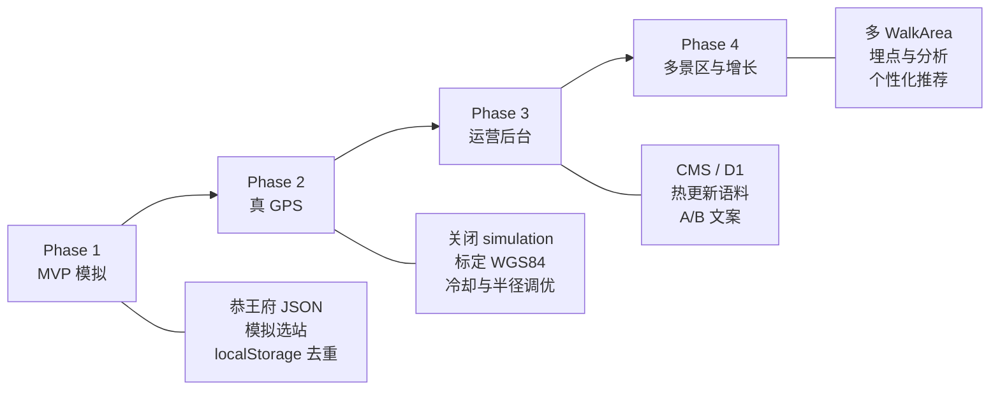
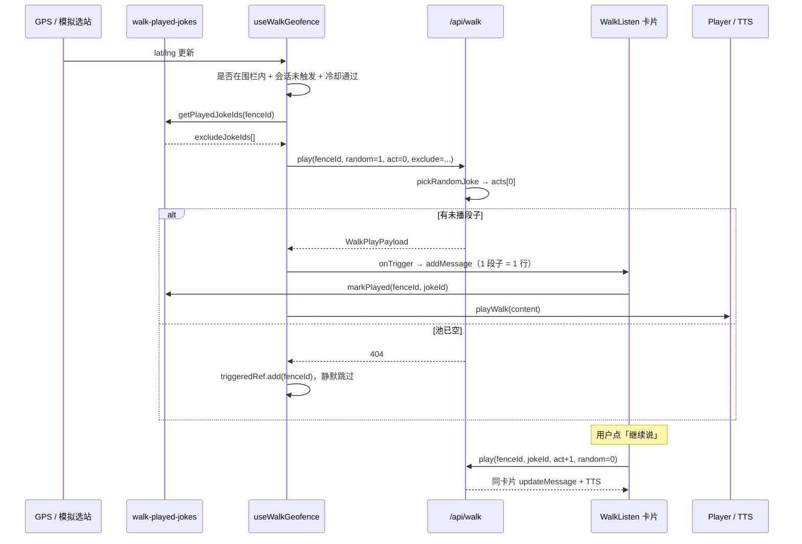
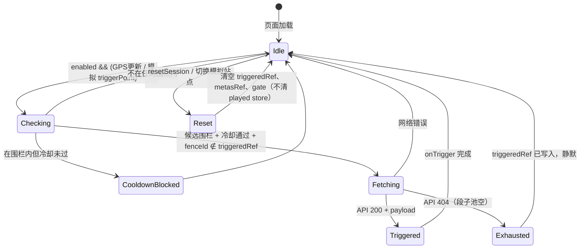
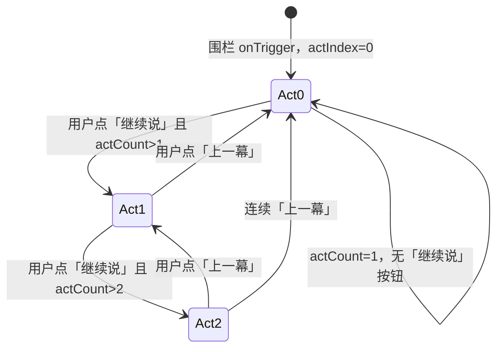
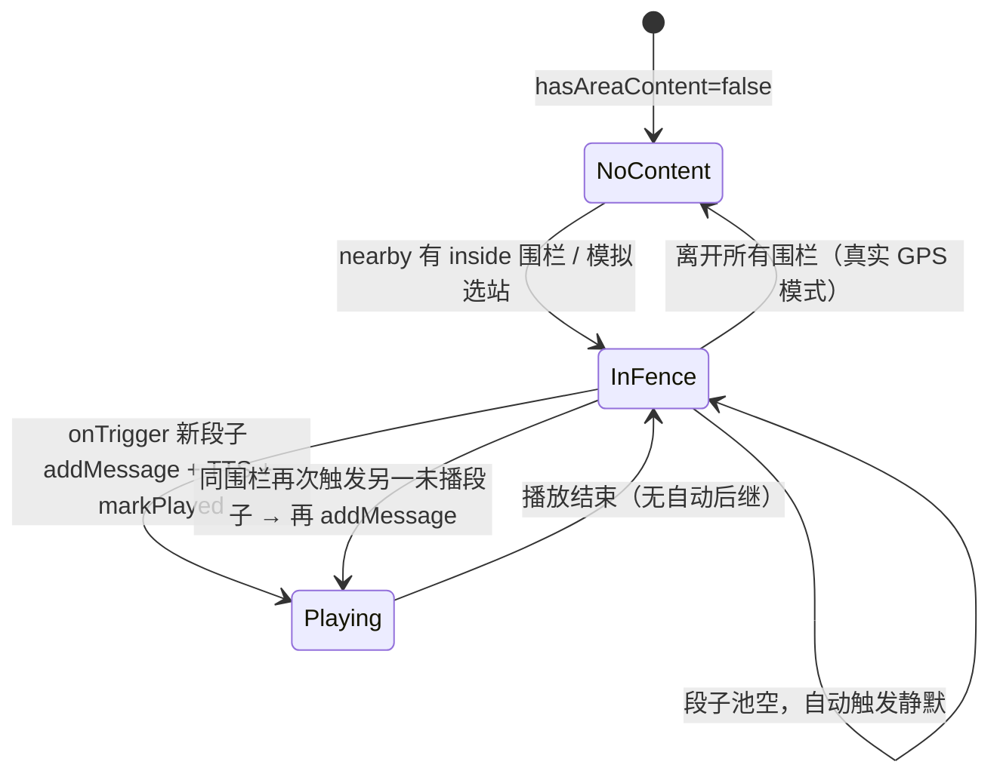

# 边走边听 — 架构约定与状态机

本文档描述「边走边听」的**设计目标、规划思路、内容层级、语料格式、围栏触发、播放去重、运营配置与客户端状态机**。实现以本文档与 `api/config/` 为准。

---

## 0. 设计目标与规划思路

### 0.1 MVP 要验证什么

| 假设 | 验证方式 |
|------|----------|
| 景区动线上「到点即播」比主动点读更有沉浸感 | 围栏自动触发 + 第一幕钩子 |
| 毒舌老炮 × 苏轼双人设能拉高停留与分享 | 默认旅伴在「我的」页设置，边走边听统一音色 |
| 恭王府 12 站语料密度足够支撑一次完整游览 | 每站 2 段子 × 1～3 幕 |
| 产品形态值得继续投入运营与真 GPS | **先模拟围栏**，内容迭代稳定后再标定 WGS84 |

**MVP 范围：** 单景区（恭王府）、模拟选站、本地 JSON 语料、无运营后台。

### 0.2 核心产品戒律（不可妥协）

1. **已播段子不得重复自动推送** — 用户在同一围栏听过的段子 id 持久化记录；再次进围栏只从未播池随机。见 [§4.2](#42-随机段子与去重规则)。
2. **进围栏 = 轻，续读 = 深** — 自动只播 `acts[0]`；用户点「继续说」才展开 2、3 幕。
3. **一段子一卡片，多幕卡片内切** — 聊天列表按**段子**追加行（`addMessage`）；同一段子内的多幕用「继续说 / 上一幕」在卡片内切换（`updateMessage`）。
4. **语料先行、存储后置** — MVP 用 JSON 文件 + `sync:functions-data`；不上 D1，降低内容与工程耦合。

### 0.3 内容模型演进（为何是 景区 → 围栏 → 段子 → 幕）

旧模型用 TS 内嵌 `tree`（L1 自动 / L2 分支 / L3 深度），运营与工程都难扩展。新模型：

```
旧 L1 自动触发     →  随机段子 acts[0]
旧 L2-A / L2-B     →  独立 joke（main 多幕 + alt 单幕）
旧 L3 深度         →  main 段子 acts[2]
```

**好处：**

- 运营按「站 × 段子 × 幕」写稿，与动线一一对应。
- 随机池在 `fence.jokes[]` 上，无需改代码即可增删段子。
- 一景区一 JSON，新增景区 = 新文件 + 注册，不拆围栏文件。

### 0.4 阶段规划（Roadmap）



| 阶段 | 目标 | 交付物 | 状态 |
|------|------|--------|------|
| **Phase 1** | 验证钩子 + 续读 UX | 恭王府语料、WalkListen 页、模拟围栏、段子去重 | **进行中** |
| **Phase 2** | 现场可用 | `simulation.enabled=false`、JSON 内真实坐标、GPS 抖动与冷却实测 | 未开始 |
| **Phase 3** | 运营可改稿 | 后台编辑 JSON 字段或 D1，替代手改 + sync | 未开始 |
| **Phase 4** | 规模化 | 多景区注册、埋点（`triggerType` / `jokeId` / `actIndex`）、推荐策略 | 未开始 |

### 0.5 关键架构决策（Why）

| 决策 | 理由 | 代价 |
|------|------|------|
| 模拟围栏先于真 GPS | 内容与 UX 迭代不依赖现场踩点 | 坐标需 Phase 2 重标 |
| 列表 append 段子 / 卡片内切幕 | 围栏多段子各占一行；同段子多幕不增行 | 消息 store 需 `jokeId` + `actIndex` / `actCount` |
| 客户端持久化已播段子 | MVP 无账号体系；localStorage 足够 | 换设备不共享；Phase 3 可迁服务端 |
| `exclude` 经 API 传递 | 随机逻辑集中在 `pickRandomJoke`，Express/CF 一致 | 每次自动触发多传一段 query |
| 会话 `triggeredRef` + 持久 `played` 双层 | 会话防同站连播；持久防跨会话重复 | 两概念需文档区分，见 §4.2 |

---

## 1. 内容层级

```
景区 (WalkArea)          一景区一 JSON 文件
 └── 围栏 (WalkFence)    n 个，有 GPS + 半径
      └── 段子 (WalkJoke) n 个，进围栏时随机抽 1 个（从未播池）
           └── 幕 (WalkAct)  1～3 条，用户感兴趣才继续读
```

| 层级 | 说明 | 触发方式 |
|------|------|----------|
| **景区** | 如恭王府；对应 `api/data/{area-id}.json` | — |
| **围栏** | 动线上的一个点位（如「蝠池」） | GPS 进入半径 / 模拟选站 |
| **段子** | 同一围栏下的独立叙事单元 | **进围栏自动随机 1 个未播段子**，只播第 1 幕 |
| **幕** | 段子内的分段文案 | 用户点 **「继续说」** 才播 2、3 幕 |

**产品原则**

- 进围栏 = 轻量钩子（随机未播段子 × 第一幕），不强迫听完。
- **聊天列表**：每个段子占一行；同一围栏多次拿到不同段子时，列表会追加多行（可同属一个 `fenceId`）。
- **卡片内**：用户主动「继续说 / 上一幕」只在**当前段子**内切幕，不新增列表行。
- **同一段子自动触发成功后即标记已播**；该围栏全部段子播完后，自动触发静默跳过（API 404）。

---

## 2. 语料文件约定

### 2.1 文件位置

| 路径 | 说明 |
|------|------|
| `api/data/gong-wang-fu.json` | 恭王府景区语料（当前 MVP） |
| `api/data/walk-area-types.ts` | TypeScript 类型定义 |
| `api/data/walk-areas.ts` | 加载 JSON，注册到 `WALK_AREAS` |
| `api/data/walk-snippets.ts` | 运行时索引、围栏查询、`resolveWalkPlay` |

**约定：一景区一 JSON，暂不按围栏拆文件。** 新增景区时：

1. 新增 `api/data/{area-id}.json`
2. 在 `walk-areas.ts` 的 `WALK_AREAS` 中注册
3. 运行 `npm run sync:functions-data`

### 2.2 JSON Schema（示意）

```json
{
  "id": "gong-wang-fu",
  "name": "恭王府",
  "areaTag": "gong-wang-fu",
  "simulation": {
    "baseLat": 39.9371,
    "baseLng": 116.3862,
    "coordStepLat": 0.00022,
    "radiusMeters": 30
  },
  "fences": [
    {
      "id": "gc-05",
      "label": "蝠池",
      "triggerHint": "绕过独乐峰，看到形似蝙蝠的水池",
      "primaryCompanionId": "sharp-elder",
      "location": {
        "lat": 39.93798,
        "lng": 116.3862,
        "radiusMeters": 30
      },
      "jokes": [
        {
          "id": "gc-05-main",
          "label": "水为财",
          "acts": [
            { "versionId": "gc-05-l1", "content": "第一幕…" },
            { "versionId": "gc-05-l2a", "content": "第二幕…", "label": "水为财" },
            { "versionId": "gc-05-l3", "content": "第三幕…" }
          ]
        },
        {
          "id": "gc-05-alt",
          "label": "和珅的福字碑",
          "acts": [
            { "versionId": "gc-05-l2b", "content": "单幕段子…" }
          ]
        }
      ]
    }
  ]
}
```

**字段说明**

| 字段 | 必填 | 说明 |
|------|------|------|
| `fences[].primaryCompanionId` | 是 | 该围栏默认旅伴（如 `sharp-elder` / `su-dongpo`） |
| `jokes[].acts` | 是 | 长度 1～3；`actIndex` 从 0 起 |
| `acts[].versionId` | 是 | 内容版本 ID，用于 TTS 缓存键 |
| `acts[].label` | 否 | 第 2 幕及以后的小标题 |
| `simulation` | 否 | MVP 模拟游览用，非现场 GPS 标定 |

### 2.3 改文案流程

```bash
# 1. 编辑 JSON
vim api/data/gong-wang-fu.json

# 2. 同步到 Cloudflare Functions 静态数据
npm run sync:functions-data

# 3. 刷新客户端
```

---

## 3. API 约定

| 方法 | 路径 | 说明 |
|------|------|------|
| GET | `/api/walk/nearby?lat=&lng=` | 附近围栏列表 |
| GET | `/api/walk/nearby?lat=&lng=&verbose=1` | 含 `inside`、`distanceMeters` |
| GET | `/api/walk/:fenceId/play` | 取指定幕的文案 |
| GET | `/api/walk/tap` | 围栏内随机未播段子 / 围栏外调皮话 |
| GET | `/api/config/walk` | 运营策略（冷却、半径、模拟开关等） |

### 3.1 播放接口 `GET /api/walk/:fenceId/play`

**Query 参数**

| 参数 | 默认 | 说明 |
|------|------|------|
| `companionId` | `su-dongpo` | 旅伴 ID（TTS 音色） |
| `jokeId` | — | 指定段子；省略且 `random≠0` 且 `act` 缺省或为 `0` 时随机 |
| `act` | `0` | 幕下标，0-based |
| `random` | `1` | `0` = 不随机，取 `jokes[0]` |
| `exclude` | — | 逗号分隔的已播 `jokeId` 列表，随机时排除 |
| `trigger` | `auto` | `auto` \| `tap`（埋点用） |

**围栏自动触发（服务端逻辑）**

等价于：

```
GET /api/walk/:fenceId/play?random=1&act=0&exclude=gc-05-main&trigger=auto
→ pickRandomJoke(fence.jokes, exclude)
→ 返回 acts[0]；池空则 404
```

**用户点「继续说」**

```
GET /api/walk/:fenceId/play?jokeId=gc-05-main&act=1&random=0&trigger=tap
```

（续读不传 `exclude`，指定 `jokeId` 即可。）

**响应 `WalkPlayPayload`（核心字段）**

```typescript
{
  snippetId: string;      // 围栏 id（历史命名，即 fenceId）
  companionId: string;
  content: string;
  duration: number;       // 估算秒数，见 speech-config
  triggerType: 'auto' | 'tap' | 'offsite';
  jokeId?: string;
  jokeLabel?: string;
  actIndex?: number;
  actCount?: number;
  actLabel?: string;
  fenceLabel?: string;
}
```

**404** — 围栏不存在，或该围栏所有段子均在 `exclude` 中（池已耗尽）。

---

## 4. 围栏触发 → 随机段子 → 播放

### 4.1 端到端流程



### 4.2 随机段子与去重规则

实现：`api/data/walk-snippets.ts` → `pickRandomJoke(fence, excludeJokeIds)`

| 规则 | 层级 | 说明 |
|------|------|------|
| **未播池随机** | 持久（localStorage） | 在 `fence.jokes` 中排除 `excludeJokeIds` 后均匀随机 |
| **标记已播** | 持久 | 自动触发成功且 `actIndex===0` 时 `markPlayed(fenceId, jokeId)` |
| **同会话每站一次** | 会话 ref | `triggeredRef`：本会话同一 `fenceId` 不重复走自动触发流程 |
| **池耗尽** | API + Hook | `pickRandomJoke` 返回空 → 404；Hook 仍 `triggeredRef.add`，不再请求 |
| **模拟切站** | 会话 | `resetSession()` 清空 `triggeredRef`，可对新站再触发；**已播段子仍排除** |
| **手动清记录** | 持久 | `useWalkPlayedJokesStore.clearFence` / `clearAll`（调试用） |

**两层状态对比**

```
triggeredRef     → 「这次打开页面，这个站有没有已经自动播过」
byFence[jokeIds] → 「历史上这个站哪些段子已经自动播过」
```

用户手动点「继续说」的 2、3 幕 **不** 额外 `markPlayed`（段子在 act 0 已标记）。

### 4.3 聊天列表 vs 卡片内导航（两层 UX）

**层级不要混：围栏 ⊃ 段子 ⊃ 幕；列表跟段子，卡片跟幕。**

#### 聊天列表 — 按段子追加（`addMessage`）

| 事件 | 列表行为 |
|------|----------|
| 进围栏自动触发，抽到一个新段子 | **+1 行**（一张卡片，对应一个 `jokeId`） |
| 同一围栏再次触发到**另一个**未播段子 | **再 +1 行**（可与前几行同属同一 `fenceId`） |
| 同一段子内切幕 | **不增行**（见下） |

典型场景：恭王府某站有 `gc-05-main` 与 `gc-05-alt` 两个段子。用户第一次到站听到 main → 列表 1 行；之后再次到站（新会话或模拟 reset 后）抽到 alt → 列表 **2 行**，都标记在「蝠池」下。

实现：`WalkListen.handleGeofenceTrigger` → `addMessage`；每条 message 带 `jokeId`、`fenceId`（`snippetId`）、`actIndex`、`actCount`。

#### 卡片内 — 按幕导航（`updateMessage`）

| 事件 | 卡片行为 |
|------|----------|
| 用户点「继续说」 | 同一条 message：`updateMessage` 换 `content`，`actIndex + 1` |
| 用户点「上一幕」 | 同一条 message：`updateMessage`，`actIndex - 1` |
| 单幕段子（`actCount === 1`） | 不显示「继续说 / 上一幕」 |

实现：`WalkListen.applyCardAct` → `updateMessage`，**绝不**对续读 `addMessage`。

### 4.4 已播段子 Store

| 项 | 值 |
|----|-----|
| 文件 | `src/store/walk-played-jokes.ts` |
| 持久化键 | `joyjoy-walk-played-jokes` |
| 结构 | `{ byFence: Record<fenceId, jokeId[]> }` |
| 写入时机 | `WalkListen.handleGeofenceTrigger`，`actIndex === 0` 且 `jokeId` 存在 |
| 读取时机 | `useWalkGeofence` 请求前 `getPlayedJokeIds(fenceId)` → query `exclude` |

Phase 3 可将 `byFence` 同步至服务端账号维度；MVP 仅本地。

---

## 5. 运营配置（间隔 / 半径 / 模拟）

**单一数据源：** `api/config/walk-config.ts`、`api/config/speech-config.ts`  
修改后执行 `npm run sync:functions-data`。客户端可读 `GET /api/config/walk`。

### 5.1 主动触发间隔 `autoTrigger`

控制 **两次围栏自动触发** 的最小间隔（防 GPS 抖动连播）。

| 配置项 | 默认值 | 含义 |
|--------|--------|------|
| `cooldownMs` | `120000`（2 分钟） | 距上次触发不足此时间则抑制 |
| `minDistanceMeters` | `500` | **或** 用户移动超过此距离，可突破冷却 |

判定函数：`canAutoTriggerWalk(gate, lat, lng)`  
满足其一即可触发：`now - gate.at >= cooldownMs` **或** `distance(gate, now) >= minDistanceMeters`。

### 5.2 围栏半径 `fence.byAreaTag`

| areaTag | 默认半径 |
|---------|----------|
| `gong-wang-fu` | 30m |
| `defaultMeters` | 50m |

JSON 内 `location.radiusMeters` 可与配置一致；运行时以语料内为准。

### 5.3 定位采样 `geolocation`

| 配置项 | 默认值 | 含义 |
|--------|--------|------|
| `enableHighAccuracy` | `true` | 高精度 GPS |
| `maximumAgeMs` | `5000` | 缓存定位最大年龄 |
| `timeoutMs` | `15000` | 定位超时 |

### 5.4 模拟模式 `simulation`（MVP）

| 配置项 | 当前值 | 含义 |
|--------|--------|------|
| `enabled` | `true` | 用站点条选站，非真实 GPS |
| `areaTag` | `gong-wang-fu` | 当前验证景区 |
| `skipAutoTriggerCooldown` | `true` | 模拟连点时不做 2 分钟冷却 |

### 5.5 播放时长估算 `speech-config`

用于 UI 进度与 `duration` 字段（TTS 请求前的估算）。

| 配置项 | 默认值 |
|--------|--------|
| `minDurationSeconds` | 45 |
| `charsPerSecond` | 4.5 |

公式：`duration = max(minDurationSeconds, ceil(字数 / charsPerSecond))`

---

## 6. 状态机

### 6.1 围栏会话状态机（`useWalkGeofence`）

每个 WalkListen 页面挂载维护一份会话 ref 状态。



**状态变量**

| Ref / Store | 类型 | 含义 |
|-------------|------|------|
| `triggeredRef` | `Set<fenceId>` | 本会话已自动触发过的围栏 |
| `metasRef` | `WalkSnippetMeta[]` | 缓存 nearby 列表 |
| `autoTriggerGateRef` | `{ at, lat, lng }` | 上次成功触发的时间与坐标 |
| `byFence` (persist) | `Record<fenceId, jokeId[]>` | 跨会话已播段子 |

**转移条件（Checking → Fetching）**

1. `distance(user, fence) <= radius`
2. `fenceId ∉ triggeredRef`（或模拟 `forcePointId` 强制重触发）
3. `skipAutoTriggerCooldown` **或** `canAutoTriggerWalk(...) === true`

### 6.2 段子卡片状态机（单条 `WalkChatMessage`）

每张卡片独立；`actCount` 来自服务端。



**UI 规则**

| actIndex | actCount | 上一幕 | 继续说 |
|----------|----------|--------|--------|
| 0 | 1 | 隐藏 | 隐藏 |
| 0 | 2+ | 隐藏 | 显示 |
| 1…n-2 | n | 显示 | 显示 |
| n-1 | n | 显示 | 隐藏（显示「已是最后一幕」） |

进度指示：`{actIndex + 1}/{actCount}`（仅 `actCount > 1` 时显示）。

### 6.3 页面级状态（`WalkListen`）



**旅伴头像**

- 边走边听**不支持页内切换旅伴**；始终使用「我的」页 `defaultCompanionId`（TTS 音色与头像）。
- 围栏 JSON 内 `primaryCompanionId` 仅作语料/运营标注，运行时不再覆盖用户默认旅伴。
- 城市故事在播放页切换旅伴 = 切换不同 narrator 版本（独立脚本），与边走边听策略分离。

### 6.4 播放器状态（`player` store）

| mode | 说明 |
|------|------|
| `walk` | 边走边听 TTS |
| `city` / `playlist` | 故事播放 |

`playWalk(payload, companionId)` → 请求 `/api/tts?text=...`，HTML5 Audio 播放。  
walk 模式下新触发会 `interrupt=true` 打断当前条。

---

## 7. 代码索引

| 模块 | 路径 |
|------|------|
| 语料 JSON | `api/data/gong-wang-fu.json` |
| 类型 | `api/data/walk-area-types.ts` |
| 加载 / 注册 | `api/data/walk-areas.ts` |
| 围栏索引 & resolve | `api/data/walk-snippets.ts` |
| 运营配置 | `api/config/walk-config.ts` |
| 时长估算 | `api/config/speech-config.ts` |
| API 路由 | `api/routes/walk.ts` |
| 生产 API | `functions/api/[[path]].js` |
| 围栏 Hook | `src/hooks/useWalkGeofence.ts` |
| 聊天 UI | `src/pages/WalkListen.tsx` |
| 消息 store | `src/store/walk-chat.ts` |
| **已播段子 store** | `src/store/walk-played-jokes.ts` |
| 播放器 | `src/store/player.ts` |
| 同步脚本 | `scripts/sync-functions-data.ts` |

---

## 8. 后续扩展

| 能力 | 说明 | 阶段 |
|------|------|------|
| 真 GPS 标定 | 关闭 `simulation.enabled`，更新 JSON 内 WGS84 | Phase 2 |
| 运营后台 | 编辑 JSON / D1，替代手改文件 | Phase 3 |
| 已播同步账号 | `byFence` 迁服务端，换机不丢 | Phase 3 |
| 池耗尽 UX | 提示「本站已听完」或引导下一围栏 | Phase 2+ |
| 埋点 | `triggerType`、`jokeId`、`actIndex`、exclude 池大小 | Phase 4 |
| 多景区 | 注册多个 `WalkArea`，路由与 UI 选景区 | Phase 4 |

**已实现（勿重复开发）：** 段子去重（localStorage + `exclude` API）、卡片内切幕、模拟围栏、JSON 语料层级。

---

## 9. 与旧模型的关系

| 旧概念 | 新概念 |
|--------|--------|
| L1 自动触发 | 随机未播段子 `acts[0]` |
| L2-A / L2-B 分支 | 独立段子，或 main 段子的 `acts[1]` |
| L3 深度 | `acts[2]` |
| `tree` in TS | 已废弃 → `jokes[].acts[]` in JSON |
| L2 分支展开追加行 | 已废弃 → **新段子** append 行；**同段子多幕**卡片内切 |
| 同站重复随机同一段子 | 已废弃 → `walk-played-jokes` + `exclude` |
